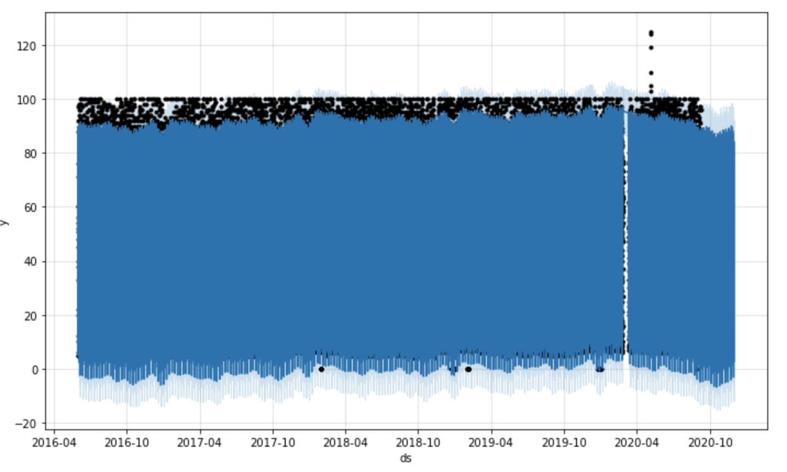
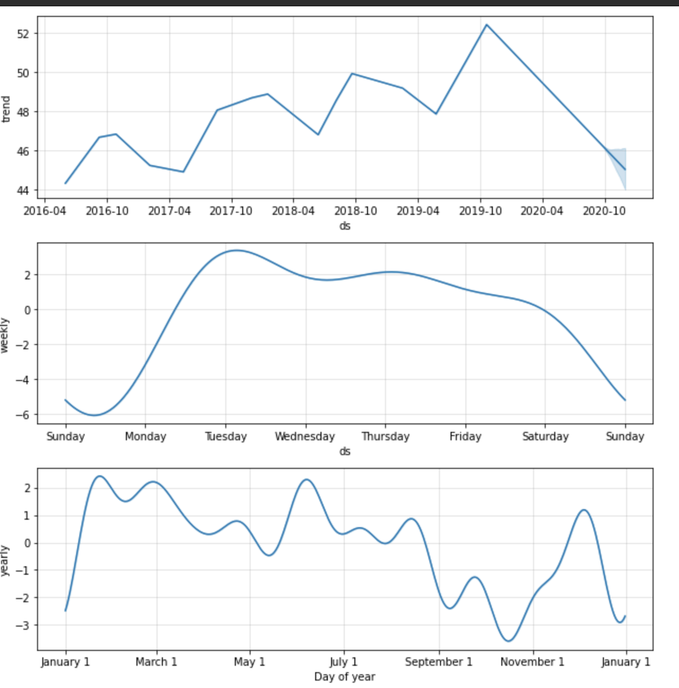
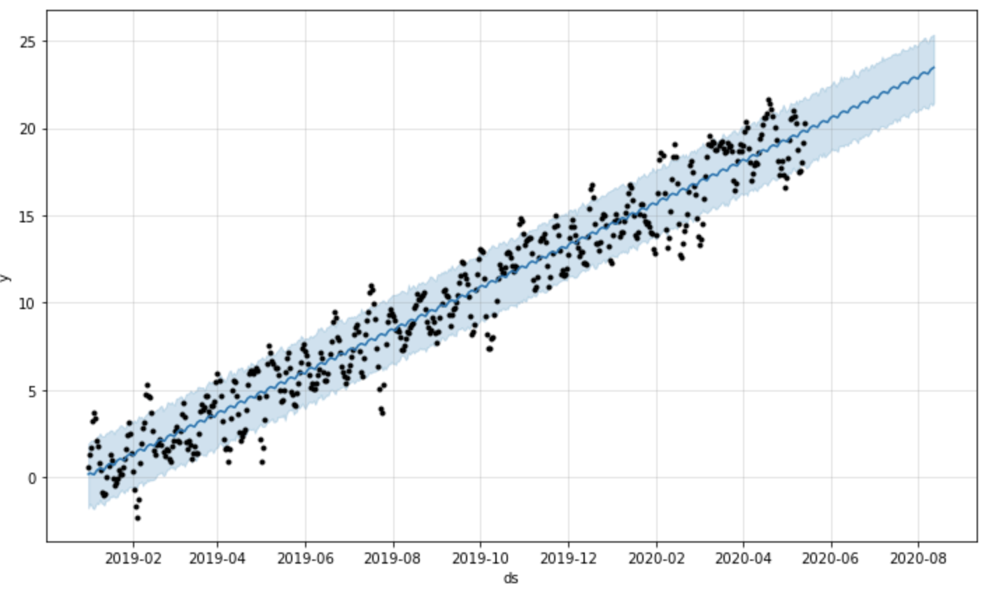

# Time Series Analysis with Machine Learning

You’re a growth analyst at MercadoLibre. With over 200 million users, MercadoLibre is the most popular e-commerce site in Latin America. You've been tasked with analyzing the company's financial and user data in clever ways to make the company grow. So, you want to find out if the ability to predict search traffic can translate into the ability to successfully trade the stock.

---

## Technologies

This project leverages python 3.7 with the following packages:

* [Facebook Prophet](https://facebook.github.io/prophet/docs/installation.html) - A procedure for forecasting time series data based on an additive model where non-linear trends are fit with yearly, weekly, and daily seasonality, plus holiday effects.

---

## Installation Guide

    
To install Prophet, open a terminal window, and then complete the following steps:

Activate your Conda dev environment.

Run the following command:

    conda install -c conda-forge fbprophet.

---

## Usage

Produce a Jupyter notebook that contains your data preparation, analysis, and visualizations for all the time series data that the company needs to understand. The 5 steps are the following:

Step 1: Find unusual patterns in hourly Google search traffic

Step 2: Mine the search traffic data for seasonality

Step 3: Relate the search traffic to stock price patterns

Step 4: Create a time series model with Prophet

Step 5: Forecast revenue by using time series models

The final outcome should contain the following:

-  Visual depictions of seasonality (as measured by Google Search traffic) that are of interest to the company.

-  An evaluation of how the company’s stock price correlates to its Google Search traffic.

-  A Prophet forecast model that can predict hourly user search traffic.

-  Answers to questions in the instructions that you write in your Jupyter Notebook.

-  A plot of a forecast for the company’s future revenue.

---

## Contributors

Brought to you by Edgar Coronado

---

## License

MIT